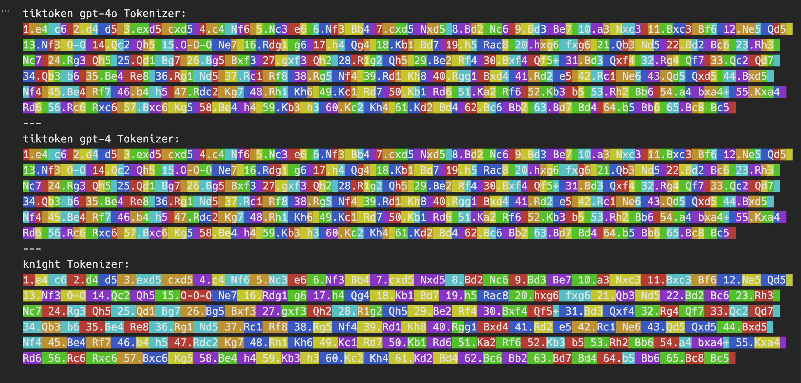

# kn1ght: A Family of Chess Language Models


A family of small chess language models designed for tutoring, focused on opening-phase play. Models are trained on PGN notation using a custom [chess-optimized Byte Pair Encoding (BPE) tokenizer](https://github.com/DVDAGames/pgn-tokenizer) and a three-stage pipeline:

1. pre-training on a [dataset of chess games](https://huggingface.co/datasets/InterwebAlchemy/pgn-dataset) adapted from the work of the Chess Research Project, which sourced the original games from [ChessDB](https://chessdb.sourceforge.net/)
2. legality-filtered Supervised Fine-Tuning (SFT) using `python-chess` for move validation, with opening lines oversampled from the [Lichess chess openings dataset](https://huggingface.co/datasets/Lichess/chess-openings) (CC0)
3. Direct Preference Optimization (DPO) quality alignment using Stockfish evaluations to generate preference pairs

## Models

Models are named after chess time controls to reflect their size tier.

| Model                                                                 | Params    | Legal Move Rate | Status      |
| --------------------------------------------------------------------- | --------- | --------------- | ----------- |
| [kn1ght-bullet](https://huggingface.co/InterwebAlchemy/kn1ght-bullet) | 4.3M      | 99.8%           | Published   |
| kn1ght-blitz                                                          | ~27.5M    | —               | In-Progress |
| kn1ght-rapid                                                          | ~150–200M | —               | Planned     |
| kn1ght-classical                                                      | ~1–3B     | —               | Planned     |

In testing, [kn1ght-bullet](https://huggingface.co/InterwebAlchemy/kn1ght-bullet) (4.3M parameters) nearly matches GPT-3.5 Turbo Instruct, a model with ~175B parameters that [anecdotally performs well playing chess](https://dynomight.net/chess/) in opening-phase centipawn loss (CPL), the metric the [Stockfish engine](https://stockfishchess.org/) uses to evaluate move quality. In the middle game, evaluated on a small sample of chess puzzle positions, [kn1ght-bullet](https://huggingface.co/InterwebAlchemy/kn1ght-bullet) struggles due to its limited training and small size, but it still performs nearly as well as `gpt-4.1-nano`, a model with ~8B parameters, on these puzzle positions.

### Evaluations

Evaluated against chess-specialist and frontier LLMs on opening play (50 positions × 10 generations).

| Model                                                                  | Params   | Mean CPL ↓ | Legality  | Blunder % |
| ---------------------------------------------------------------------- | -------- | ---------- | --------- | --------- |
| Gemini 3.1 Flash Lite                                                  | ~8B      | 2.58       | 100%      | 0.0%      |
| [chessgpt-base-v1](https://huggingface.co/Waterhorse/chessgpt-base-v1) | ~85M     | 4.92       | 99.6%     | 0.2%      |
| gpt-3.5-turbo-instruct                                                 | ~175B    | 5.79       | 99.4%     | 0.0%      |
| [kn1ght-bullet](https://huggingface.co/InterwebAlchemy/kn1ght-bullet)  | **4.3M** | **5.83**   | **99.8%** | **0.0%**  |
| DeepSeek V3                                                            | ~685B    | 8.18       | 86.0%     | 0.4%      |

[kn1ght-bullet](https://huggingface.co/InterwebAlchemy/kn1ght-bullet) beats [chessgpt-base-v1](https://huggingface.co/Waterhorse/chessgpt-base-v1) in Sicilian and Ruy Lopez lines. The gap in under-trained openings (Benoni, Colle, Max Lange) should narrow with larger `kn1ght` family model tiers.

An initial pre-evaluation was run against several other models, but the above table reflects the selection of models that were most interesting for comparison and discussion. The full evaluation notebook is available in the repo for reference.

The full list of models evaluated in the initial evaluation is as follows:

| Model Name                                                         | Parameters | Description                                                                                                          |
| ------------------------------------------------------------------ | ---------- | -------------------------------------------------------------------------------------------------------------------- |
| kn1ght-sft-v5                                                      | ~4.3M      | kn1ght-bullet checkpoint after five rounds of legality-filtered SFT, but prior to DPO                                |
| kn1ght-dpo                                                         | ~4.3M      | kn1ght-bullet checkpoint after a short DPO run; this checkpoint would go on to become `kn1ght-bullet`                |
| chessgpt-base-v1                                                   | ~85M       | ChessGPT base model                                                                                                  |
| [chesspythia-70m](https://huggingface.co/mlabonne/chesspythia-70m) | ~70M       | Pythia70m model fine-tuned on chess data for the [chessllm project](https://huggingface.co/spaces/mlabonne/chessllm) |
| gpt-3.5-turbo-instruct                                             | ~175B      | GPT-3.5 Turbo Instruct model                                                                                         |
| gpt-oss-20b                                                        | ~20B       | GPT-OSS model                                                                                                        |
| gpt-4.1-nano                                                       | ~8B        | GPT-4.1 Nano model                                                                                                   |
| gpt-5-nano                                                         | ~5B        | GPT-5 Nano model                                                                                                     |
| claude-haiku-4.5                                                   | ~4.5B      | Claude Haiku model                                                                                                   |
| gemini-3.1-flash-lite-preview                                      | ~3.1B      | Gemini Flash Lite Preview model                                                                                      |
| deepseek-v3                                                        | ~685B      | DeepSeek V3 model                                                                                                    |

All frontier-lab models were tested via the OpenRouter API, chess-specific models were loaded via HuggingFace Transformers library, `kn1ght-sft-v5` and `kn1ght-dpo` were tested via local inference using the checkpoints from the training pipeline.

## Tokenizer

A [BPE tokenizer](https://github.com/DVDAGames/pgn-tokenizer) trained specifically on PGN notation rather than natural language. Pre-tokenization splits on move-number prefixes, individual moves (`e4`, `Nf3`, `O-O`, `cxd5`), and check/checkmate symbols.

- **Vocab size**: 4,096 tokens
- **Compression**: ~2.3× over raw UTF-8; ~30% fewer tokens than GPT-4o's `cl100k` on the same games
- **Special tokens**: `[g_start]` (0), `[g_end]` (1), `[unknown]` (2), `[pad]` (3)



The tokenizer is loadable directly by [transformers.js](https://huggingface.co/docs/transformers.js) for in-browser inference.

## Architecture

GPT-style decoder-only transformer, implemented from scratch in [`scripts/train.py`](scripts/train.py).

### kn1ght-bullet

`kn1ght-bullet` was trained on Apple Silicon ([MPS](https://docs.pytorch.org/docs/stable/notes/mps.html)) using a MacBook Pro M4 in a single overnight pre-training run, a five-round legality-filtered SFT loop, and a short 500-step DPO run.

| Hyperparameter      | Value      |
| ------------------- | ---------- |
| Layers              | 4          |
| Attention heads     | 4          |
| Embedding dimension | 256        |
| Context length      | 256 tokens |
| Parameters          | ~4.3M      |
| Vocabulary          | 4,096      |

**Note**: Weight tying is applied between the token embedding matrix and the final projection head.

### kn1ght-blitz

`kn1ght-blitz` pre-training ran on Apple Silicon (MPS) using a MacBook Pro M4. Pre-training used the full 3.5M-game corpus — 35× more data than bullet — for 126,000 steps before the val loss plateaued. Context length doubles to 512 tokens for deeper game coverage before midgame drift. SFT expands to 400–500 named opening lines and mixes in Lichess puzzle positions with reconstructed PGN context; DPO targets 5–10k Stockfish preference pairs at higher search depth for cleaner tactical signal.

| Hyperparameter      | Value      |
| ------------------- | ---------- |
| Layers              | 8          |
| Attention heads     | 8          |
| Embedding dimension | 512        |
| Context length      | 512 tokens |
| Parameters          | ~27.5M     |
| Vocabulary          | 4,096      |

**Pre-training results**: Best val loss **1.1308** at step 126,000 (vs 1.6206 for bullet after 200k steps). Stopped at plateau — val loss improved <0.001 over the final 6,000 steps.

**Pre-training command**:

```bash
caffeinate -is uv run python scripts/train.py \
  --n-layer 8 --n-head 8 --n-embd 512 --block-size 512 \
  --max-games 3500000 \
  --iters 150000 \
  --batch-size 32 \
  --lr 3e-4 \
  2>&1 | tee .data/blitz_training.log
```

**Note**: Weight tying is applied between the token embedding matrix and the final projection head. Use `batch-size 32` on MPS — larger batches push attention matrices into a slow memory path on Apple Silicon.

## Training Pipeline

The kn1ght training pipeline is designed to produce a small model that generates legal moves. Smaller models focus on the opening phase where patterns are more discernible and the model can easily learn to generate legal moves without needing to understand tactics or modeling long-term strategies. Future larger models will expand the focus to later phases of the game, including things like reinforcing common checkmate patterns and endgame scenarios.

The primary use case for these models is for [tutoring](https://interwebalchemy.com/blog/post/building-a-chess-tutor/), where perfect play isn't the goal. We just want a model that can generate plausible, legal moves based on the current position and can reinforce good opening principles where the learner will spend most of their time and where the model can have more impact on their development.

### Phase 1 — Pre-training (`scripts/train.py`)

Causal language modelling on [`InterwebAlchemy/pgn-dataset-including-special-tokens`](https://huggingface.co/datasets/InterwebAlchemy/pgn-dataset-including-special-tokens) (~3.5M Lichess games, avg ELO ~2240). `kn1ght-bullet` only used 100k games; larger models will use more of the dataset.

Key techniques:

- **Turn-number de-emphasis**: move-number tokens (`1.`, `2.`, etc.) receive loss weight 0.15 — they're structurally predictable and shouldn't dominate the gradient signal
- **Opening oversampling**: 3,627 ECO-coded opening lines from [`Lichess/chess-openings`](https://huggingface.co/datasets/Lichess/chess-openings) (CC0) are repeated 10× and prepended to training data, biasing the prior toward principled opening play
- **Cosine Learning Rate (LR) decay** from `3e-4` to `3e-5` with a 500-step warmup

```bash
# Full overnight run (~5–6 hours on M4 Pro MPS)
caffeinate -is uv run python scripts/train.py \
  --max-games 100000 --iters 200000 \
  2>&1 | tee .data/training.log
```

### Phase 2 — Legality-Filtered SFT (`scripts/finetune.py`)

Rejection-sampling fine-tuning: generate continuations from opening prompts, validate every move with `python-chess`, train only on the surviving legal games. The legality pass rate improved from 9.1% (SFT v1) to 67.5% (SFT v5) across five rounds.

```bash
uv run python scripts/finetune.py \
  --checkpoint .data/models/kn1ght-small/ckpt_latest.pt \
  --n-per-opening 5
```

### Phase 3 — DPO (`scripts/dpo.py`)

Direct Preference Optimization on Stockfish-generated preference pairs (chosen = low centipawn loss, rejected = inaccuracies/blunders). Initialized from the SFT checkpoint with a frozen reference copy. Val reward accuracy: **0.885**.

```bash
uv run python scripts/dpo.py
```

### Phase 4 — Export (`scripts/export.py`)

Exports a checkpoint to a HuggingFace-ready artifact directory: fp32 ONNX, int8 quantized ONNX, tokenizer, config files.

```bash
uv run python scripts/export.py
# → dist/kn1ght-bullet/
```

## File Reference

| Path                                   | Purpose                                                                                   |
| -------------------------------------- | ----------------------------------------------------------------------------------------- |
| `scripts/train.py`                     | Phase 1: pre-training; defines `ChessGPT`, `ModelConfig`, `TokenStream`, `CHESS_OPENINGS` |
| `scripts/finetune.py`                  | Phase 2: legality-filtered SFT                                                            |
| `scripts/dpo.py`                       | Phase 3: DPO quality alignment                                                            |
| `scripts/export.py`                    | Export checkpoint → HuggingFace-ready artifacts (copies assets, writes configs)           |
| `scripts/upload.py`                    | Upload model artifacts and training checkpoints to HuggingFace Hub                        |
| `scripts/inference.py`                 | Constrained decoding utility (planned)                                                    |
| `notebooks/evaluation.ipynb`           | Evaluation harness — Phase A/C/C'/B                                                       |
| `notebooks/build-puzzle-dataset.ipynb` | Builds Lichess PGN puzzle dataset                                                         |
| `src/tokenizer/kn1ght-tokenizer.json`  | BPE tokenizer, vocab size 4,096                                                           |
| `dist/kn1ght-bullet/`                  | HuggingFace-ready export of kn1ght-bullet                                                 |
